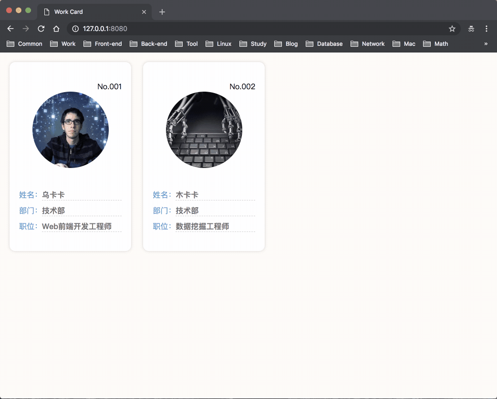

# 面纱后的 Web Components 

### Web Components 是啥？
Web Components 是一组由不同技术组合而成，用于创建或扩展可复用的自定义元素，以便于在Web程序中引用的规范。
它主要由以下4项技术组成：
* [Custom Elements（自定义元素）](http://w3c.github.io/webcomponents/spec/custom/)
* [Shadow DOM（影子DOM）](http://w3c.github.io/webcomponents/spec/shadow/)
* [HTML Templates（HTML模板）](https://html.spec.whatwg.org/multipage/scripting.html#the-template-element/)
* [HTML Imports（HTML导入）](http://w3c.github.io/webcomponents/spec/imports/)

### Web Components 能干啥？
* 提供创建或扩展跨平台的，可复用的Web组件的方法
* 提供原生支持，无需引入库或框架即可使用
* 提供熟悉的编程模型，只需使用HTML、CSS和JS来构建
* 可以隔离DOM和CSS，使之与当前宿主文档的其它DOM和CSS不会产生冲突
* 可以与其它任何Web框架一起使用而不会产生冲突
* 可以使用浏览器DevTools工具很好的开发调试

### Web Components 粗体验
我们来试着创建一个名为`work-card`的组件，通过它来简单体验一下 Web Components 的构建过程。  
我们先来看看组件长啥样？然后，再一步一步的去完成它。 



**第一步、如何创建一个Custom Elements？**  
我们可以通过`window.customElements.define()`来创建一个自定义元素，如下：

```js
class WrokCard extends HTMLElement {
  constructor() {
    super()
  }
}
window.customElements.define('work-card', WrokCard)

// 或者传入一个匿名类
window.customElements.define('work-card', class extends HTMLElement {
  constructor() {
    super()
  }
})
```

**第二步、如何创建一个Shadow DOM？**  
我们通过`element.attachShadow()`方法来创建一个影子DOM，如下：

```js
const workCard = document.createElement('work-card')
const shadowRoot = workCard.attachShadow({ mode: 'open' })
```

结合第一步，我们可以在自定义元素中创建影子DOM，如下：

```js
window.customElements.define('work-card', class extends HTMLElement {
  constructor() {
    super()
    
    // 创建影子节点
    const shadowRoot = this.attachShadow({ mode: 'open' })
  }
})
```

**第三步、如何创建一个HTML Templates？**  
前两步我们学会了如何创建自定义元素和影子DOM，这一步，我将学会如何创建一个模板并使用它。  
很简单，我们只需要将样式和结构写到`<template>`标签即可。如下：

```html
<template>
  <style>...</style>
  <div class="wrapper">
    <slot></slot>
    <div class="avatar">
      
    </div>
    <ul class="list">
      <li class="item">
        <span class="label">姓名：</span>
        <span id="name" class="value"></span>
      </li>
      <li class="item">
        <span class="label">部门：</span>
        <span id="department" class="value"></span>
      </li>
      <li class="item">
        <span class="label">职位：</span>
        <span id="position" class="value"></span>
      </li>
    </ul>
  </div>
</template>

<script>
  // 获取模板
  const content = document.querySelector('template').content
</script>
```

**第四步、如何组合成一个组件？**  
我们来创建一个文件，命名为：`work-card.html`，
然后，将上边的HTML写在`<template>`标签里，这里用来定义组件的结构与样式；
将JS写在`<script>`标签里，这里用来编写组件的行为逻辑。  

一个组件的结构大概长成这样子，请看：
```html
<template>
  <style>...</style>
  <div class="wrapper">
    <slot></slot>
    <div class="avatar">
      
    </div>
    <ul class="list">
      <li class="item">
        <span class="label">姓名：</span>
        <span id="name" class="value"></span>
      </li>
      <li class="item">
        <span class="label">部门：</span>
        <span id="department" class="value"></span>
      </li>
      <li class="item">
        <span class="label">职位：</span>
        <span id="position" class="value"></span>
      </li>
    </ul>
  </div>
</template>

<script>
  window.customElements.define('work-card', class extends HTMLElement {
    // 初始化
    constructor() {
      super()

      // 获取模板
      const $template = document.currentScript.ownerDocument.querySelector('template')
      const content = $template.content

      // 创建影子节点
      const shadowRoot = this.attachShadow({ mode: 'open' })
      
      // 将模板插入到影子节点
      shadowRoot.appendChild(content.cloneNode(true))
    }
  })
</script>
```
完整的文件内容，请[点这里查看](https://github.com/pzhyy/learn-web-components/blob/master/work-card.html)。

**第五步、如何使用一个组件？**  
在宿主文档的`<head>`里，通过`<link>`标签将组件引入，然后在`<body>`里使用即可，如下：

```html
<head>
  <link rel="import" href="work-card.html">
</head>
<body>
  <work-card avatar="images/01.jpg" name="乌卡卡" department="技术部" position="Web前端开发工程师">
    <div class="number">No.001</div>
  </work-card>
</body>
```

至此，我们学会了怎样使用 Web Components 创建一个组件并且使用它。是不是很方便呢

### Web Components 兼容性
Web Components 规范尚在草案阶段，目前市面上的多数浏览器都不能很好的运行 Web Components ，只有Chrome能完美的运行。  
不过好在开源社区为我们提供了一些Polyfill，能让哪些不支持 Web Components 的浏览器也能运行起来。

**webcomponentsjs**  
[webcomponentsjs](https://github.com/webcomponents/webcomponentsjs) 项目为 Web Components 标准提供了一系列的 Polyfill。
借助webcomponentsjs，已经可以兼容IE11+，Chrome，Firefox，Safari9+等浏览器。 足以支持轻量地使用 Web Components 相关技术。 目前Polyfill文件（非lite版本）本身大小在100k+，gzip后可以缩小到30k+。

**Polymer**  
[Polymer](https://github.com/Polymer/polymer) 项目是基于 Web Components 标准的轻量级框架，定位于简单的Polyfill和易用性封装。这些封装包括数据绑定，模板声明，事件系统等，甚至包括手势事件的API。

**其他**  
* [X-Tag](https://x-tag.github.io/)
* [Aurelia](https://aurelia.io/home)
* [Slim.js](http://slimjs.com/#/getting-started)

### Web Components 总结
1. Web Components 提供一套完善的组件封装方法，并把它标准化，这样在很大程度上提高了组件的可跨平台和可复用性，
这给组件的使用与管理都带来了很大的便利。  
2. 作为一项Web标准，浏览器原生支持，我们不用担心因为使用不同框架带来的差异，使得构建的组件不能通用的问题。
3. 尽管目前多数浏览器还未支持 Web Components，但很多流行框架的实现已经慢慢的往上边靠，是未来Web的一个发展趋势。
4. 如果 Web Components 推行起来，未来的Web构建，将会像搭积木一样方便，这是前所未有的。
5. Web Components 的实现还稍显粗糙，并没有提供数据绑定，列表渲染等好用的功能。

### 参考
* [Building Components](https://developers.google.com/web/fundamentals/web-components/?hl=zh-cn)
* [Web Components](https://developer.mozilla.org/zh-CN/docs/Web/Web_Components)
* [Introduction - webcomponents.org](https://www.webcomponents.org/introduction)